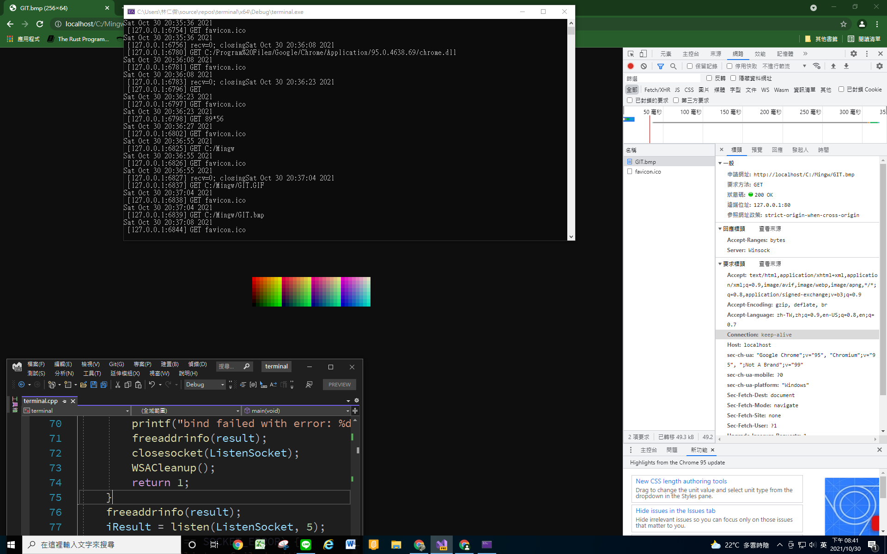

*****************
README
*****************

my notes.

`python`_ HTTP Server in python

`cpp`_ HTTP Server C++ (using Winsock)

the c++ server looks like ⬇

.. _python: sendfile.py
.. _cpp: terminal.cpp

LICENSE
=================
GPL
